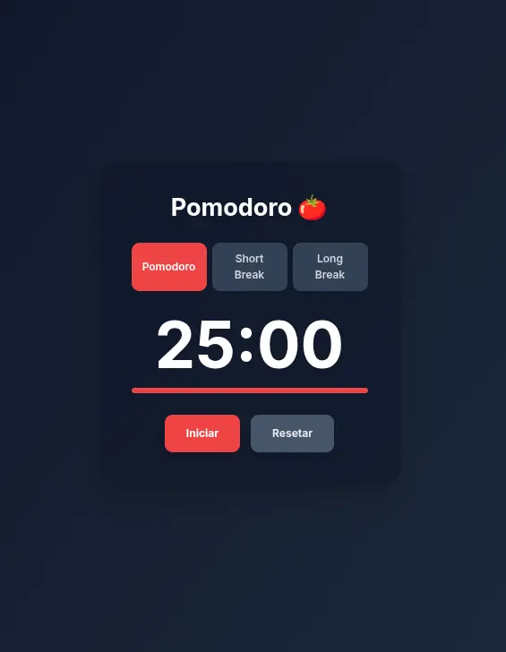

<!--
:tomato: Pomodoro PWA
Commit: Readme, PWA, first version without offline tailwind
 -->

  

# 🍅 Pomodoro

Um pomodoro é um temporiador para auxiliar no gerenciamento de controle de tempo. Este projto serve para aprendizagem e estudo
da prática de PWA ( Progressive Web Apps).

Um Progressive Web App, ou PWA, é um termo que descreve um site que foi aprimorado com tecnologias modernas para oferecer uma experiência de usuário que se aproxima muito da de um aplicativo nativo (como aqueles baixados da App Store ou Google Play).

- HTML, CSS e Tailwind para a estrutura do site.
- Javascript com funções: adaptação do tema claro/escuro conforme seu SO, temporizador, alerta sonoro e outros.
- Confira e utilize o projeto neste <a href="https://igorlazzaretti.github.io/pomodoro/"> link</a>.

## 🚀 Tecnologias Utilizadas

**Front-End:** HTML, CSS, Tailwind e JavaScript;

## Principais recursos:

- 🎨 **Design:** Moderno;
- 🧩 **Organização:** Estrutura limpa e simples;
- 📱 **Layout Responsivo:** Compatível com dispositivos móveis;
- 🍎 **PWA**: Funciona como um app nativo para o celular ou para o desktop;

## 🍎 PWA:

Este projeto é um Progressive Web App, o que significa que ele oferece uma experiência semelhante a um aplicativo nativo diretamente do seu navegador. Você pode "instalar" o site no seu celular ou computador.

- **Instalável:** Adicione o Pomodoro à sua tela inicial ou área de trabalho para acesso rápido, como um aplicativo comum.
- **Funcionalidade Offline:** O temporizador funciona mesmo se você perder a conexão com a internet, garantindo que seus ciclos de foco não sejam interrompidos (requer instalação prévia).
- **Alertas e Notificações:** Receba alertas sonoros e notificações do navegador quando um ciclo do Pomodoro ou uma pausa terminar, mesmo que o aplicativo esteja em segundo plano.

## ❤️ Ajude um Desenvolvedor

Se você gostou do site, considere ajudar o desenvolvedor com um valor simbólico.

If you liked the site, consider helping the developer with a symbolic amount.

  

## 👨‍💻 Desenvolvedor

**Igor Dossin Lazzaretti**
🔗 [LinkedIn](https://www.linkedin.com/in/igorlazzaretti/)
🌐 [Portfólio](https://igorlazzaretti.com/)
💻 [Projetos GitHub](https://github.com/igorlazzaretti?tab=repositories)

## 📸 Printscreen do Site

  

